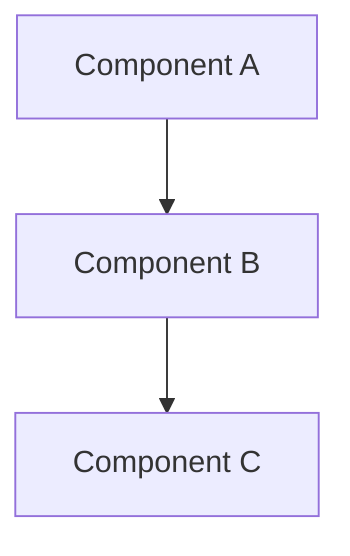
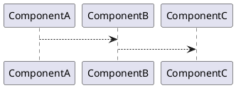

# EnTrust Solution Architecture Diagram Guide

This guide explains how to create and use solution diagrams for the EnTrust Data Governance Survey Platform.

## Quick Start

The easiest way to create a solution diagram is to use the included Mermaid diagram files:

1. **View in GitHub/GitLab**: Mermaid diagrams render automatically in markdown files
2. **View in VS Code**: Install the "Markdown Preview Mermaid Support" extension
3. **Online Editor**: Copy the diagram code to [Mermaid Live Editor](https://mermaid.live)
4. **Export**: Use Mermaid CLI or online tools to export as PNG/SVG

## Included Diagram Files

- `solution-diagram.mmd` - Complete system architecture (Mermaid format)
- `solution-diagram.puml` - Complete system architecture (PlantUML format)

## Architecture Overview

The EnTrust platform consists of:

### 1. **Frontend Layer**
- React application with Vite
- User authentication and role-based access
- Survey interface and reporting dashboard
- Real-time API communication

### 2. **Backend API Layer**
- FastAPI REST API
- Multiple routers for different functionalities
- Authentication and authorization
- LLM service integration

### 3. **Data Layer**
- PostgreSQL database for structured data
- ChromaDB for vector embeddings (RAG)
- Knowledge base files for domain expertise

### 4. **AI/ML Layer**
- LLM Service supporting multiple providers:
  - Local LLMs (LM Studio, etc.)
  - AWS Bedrock (Claude)
  - Azure OpenAI (GPT models)
- RAG (Retrieval-Augmented Generation) system
- Agentic workflow orchestrator

### 5. **Agentic System**
- Survey Parser Agent
- Maturity Assessor Agent
- Report Generator Agent
- Self-Critic Agent
- PDF Formatter Agent

## Creating Custom Diagrams

### Option 1: Mermaid (Recommended)

Mermaid is text-based and renders in many markdown viewers.

**Basic Structure:**


**View the full diagram**: Open `solution-diagram.mmd` in any Mermaid-compatible viewer.

### Option 2: PlantUML

PlantUML offers more styling options and is great for detailed diagrams.

**Basic Structure:**


**View the full diagram**: Open `solution-diagram.puml` in PlantUML viewer or VS Code with PlantUML extension.

### Option 3: Draw.io / Diagrams.net

1. Go to [app.diagrams.net](https://app.diagrams.net)
2. Create a new diagram
3. Use the architecture templates
4. Reference the components listed in this guide

### Option 4: PowerPoint / Visio

Use the component list below to manually create diagrams in presentation tools.

## Key Components to Include

### Frontend Components
- Login Page
- Customer Management (Admin)
- User Management (Admin)
- LLM Configuration (Admin)
- Survey Dashboard
- Survey Section Pages
- Reports Dashboard

### Backend Components
- Authentication Router (`/api/auth`)
- Customer Router (`/api/customers`)
- User Router (`/api/users`)
- LLM Config Router (`/api/llm-config`)
- Survey Router (`/api/survey`)
- Reports Router (`/api/reports`)

### Data Models
- Customers
- Users (SystemAdmin, CXO, Participant, Sales)
- Questions (700+ survey questions)
- Surveys
- Survey Responses
- LLM Configurations

### External Services
- PostgreSQL Database
- ChromaDB (Vector Store)
- LLM Providers (Local/AWS Bedrock/Azure OpenAI)

### Agentic Workflow
1. Survey Parser → Parse and compute statistics
2. Maturity Assessor → Evaluate against standards (uses RAG)
3. Report Generator → Create comprehensive report
4. Self-Critic → Quality check and revision
5. PDF Formatter → Generate final PDF

## Data Flow

1. **User Authentication**: Frontend → Backend → Database
2. **Survey Submission**: Frontend → Backend → Database
3. **Report Generation**: 
   - Backend retrieves survey data
   - Orchestrator coordinates agents
   - Agents use LLM Service
   - RAG Service provides context
   - Report generated and cached
4. **Report Viewing**: Frontend → Backend → Cached/Generated Report

## Deployment Architecture

The system uses Docker Compose with:
- PostgreSQL container
- Backend container (FastAPI)
- Frontend container (React/Vite)

All services communicate via Docker network.

## Tips for Creating Diagrams

1. **Start High-Level**: Begin with major components (Frontend, Backend, Database)
2. **Add Details Gradually**: Add routers, services, and agents
3. **Show Data Flow**: Use arrows to indicate request/response flow
4. **Group Related Components**: Use containers/boxes for logical grouping
5. **Color Code**: Use colors to distinguish layers (UI, API, Data, AI)
6. **Include Legends**: Add legends explaining symbols and colors

## Tools and Resources

- **Mermaid Live Editor**: https://mermaid.live
- **PlantUML Online**: http://www.plantuml.com/plantuml/uml/
- **Draw.io**: https://app.diagrams.net
- **Mermaid Documentation**: https://mermaid.js.org/
- **PlantUML Documentation**: https://plantuml.com/

## Exporting Diagrams

### Mermaid to Image
```bash
# Install Mermaid CLI
npm install -g @mermaid-js/mermaid-cli

# Convert to PNG
mmdc -i solution-diagram.mmd -o solution-diagram.png

# Convert to SVG
mmdc -i solution-diagram.mmd -o solution-diagram.svg
```

### PlantUML to Image
```bash
# Install PlantUML
# macOS: brew install plantuml
# Or use Docker: docker run --rm -v $(pwd):/work plantuml/plantuml solution-diagram.puml

# Convert to PNG
plantuml solution-diagram.puml

# Convert to SVG
plantuml -tsvg solution-diagram.puml
```

## Next Steps

1. Open `solution-diagram.mmd` in a Mermaid viewer
2. Customize the diagram for your specific needs
3. Export as PNG/SVG for presentations
4. Update the diagram as the system evolves

